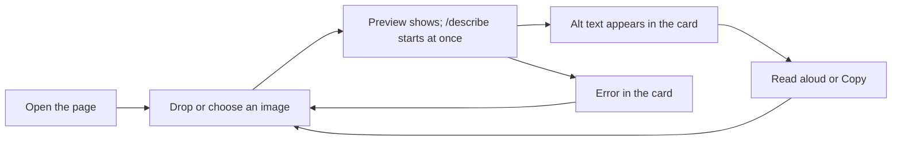

# Design

Designer: Atilade (@atiladeokegab). Owned by the designer: to change anything here, open a
change-request (AGENTS.md §7) addressed to them. Each vertical's `Design:` line says which
sections of this page it must follow.

## Flow

## Screens and commands

| Screen or command | Shows | The user can |
|---|---|---|
| Page `/`, top | A thin top bar with the "Seen" wordmark on the left; below it the hero headline and sub-line, centred | — |
| Page `/`, left pane | The drop zone; after a drop, the image preview in its place | Drop an image, click to choose a file, or drop another to start over |
| Page `/`, right pane: "What a screen reader hears" card | The alt text, and a small badge naming the provider (`claude` or `offline stub`) | Read aloud (browser `speechSynthesis`), Copy |
| Narrow screens (under 800px) | The two panes stacked: drop zone on top, card below | The same |
| Look | White background, near-black text (#191C1F), lots of whitespace. Hero: a huge, very heavy (800–900), uppercase, tightly tracked headline, centred, with one centred medium-weight sub-line under it. The image pane is a tall card with 24px rounded corners that the preview fills; the provider shows as a white pill chip over the image. The alt-text card is a floating white card with 24px corners and a soft shadow. Buttons are pills: Read aloud solid black with white text, Copy white with a 1px border. One indigo accent (#4F55F1), only for focus rings and the badge dot. Text and controls meet WCAG AA contrast; every control works from the keyboard with a visible focus ring. Style reference: a fintech homepage the designer chose; copy its style, never its brand | — |

## States

| Where | Empty | Loading | Error |
|---|---|---|---|
| Drop zone | Icon, "Drop an image here", "or choose a file" | The preview of the dropped image | Stays live: dropping again retries |
| Card | "Your image's alt text will appear here." Read aloud and Copy disabled | Shimmer and "Looking at your image…". Read aloud and Copy disabled | The card switches to its error style with one sentence from Copy (415, 413, 502 or network) |

## Copy

| Where | Words |
|---|---|
| Page title and wordmark | "Seen" |
| Hero headline | "ALT TEXT FOR ANY IMAGE, IN SECONDS." |
| Hero sub-line | "Drop an image. Hear what a screen reader should say." |
| Drop zone | "Drop an image here" / "or choose a file" |
| Card heading | "What a screen reader hears" |
| Card, empty | "Your image's alt text will appear here." |
| Card, loading | "Looking at your image…" |
| Buttons | "Read aloud", "Copy" (becomes "Copied" for 2 seconds) |
| Provider badge | "claude" / "offline stub" |
| Error, wrong type (415) | "That file isn't an image we can read. Try a PNG, JPG, WebP or GIF." |
| Error, too big (413) | "That image is over 5 MB. Try a smaller one." |
| Error, model failed (502) | "We couldn't describe that image. Drop it again to retry." |
| Error, network | "Can't reach the server. Check it's running, then drop again." |
